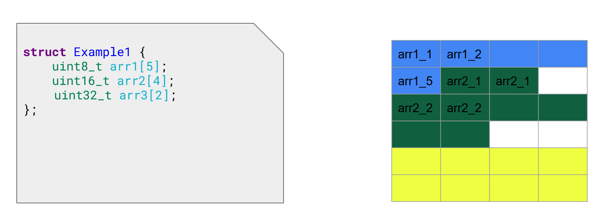
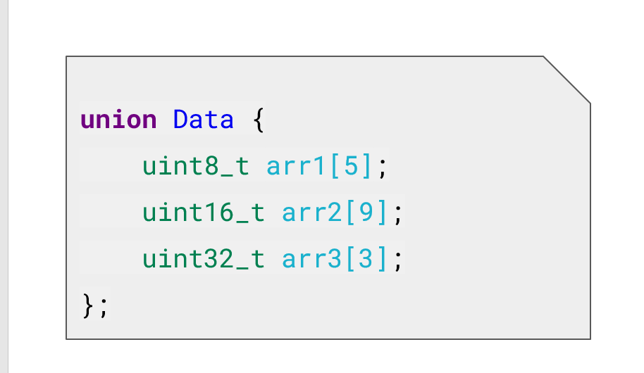
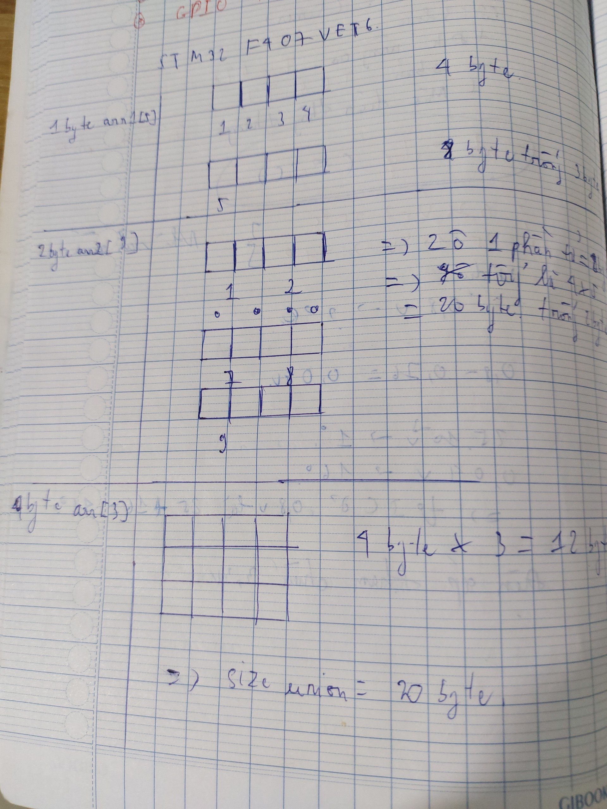
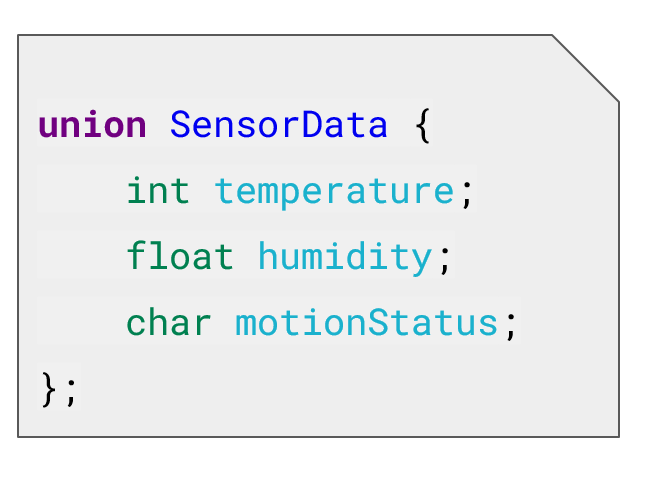

<details>
  <summary><h2>▶ C Advance </h2></summary>


<details>
  <summary><h3>Quá trình biên dịch</h3></summary>
	
Quy trình biên dịch là quá trình chuyển đổi từ ngôn ngữ bậc cao (NNBC) (C/C++, Pascal, Java, C#…) sang  ngôn ngữ máy , để máy tính có thể hiểu và thực thi.
### Quá trình biên dịch bao gồm 4 giai đoạn:
- Giai đoàn tiền xử lý (Pre-processor)
- Giai đoạn dịch NNBC sang Asembly (Compiler)
- Giai đoạn dịch asembly sang ngôn ngữ máy (Asember)
- Giai đoạn liên kết (Linker)
	
**_Pre-processor (Giai đoạn tiền xử lý):_**
- 1 Project có nhiều file:`a.h, b.h, a.c, b.c `và file `main.c` sau quá trình tiền xử lý thành 1 file duy nhất là file `main.i`.
- Lệnh trong CMD là: `gcc -E main.c -o main.i`

**3 việc xảy ra trong quá trình tiền xử lý:**
- Xóa bỏ cmt,ghi chú.
- `#include` file header, có nghĩa là nội dung file sẽ được chèn vào vị trí mà mình chỉ định.
- Triển khai macro:
	- Macro là từ dùng để chỉ những thông tin được xử lý ở tiền xử lý.
	- `#define`:
		- Macro được định nghĩa bằng cách sử dụng chỉ thị tiền xử lý #define.
		- Nơi nào có tên Macro sẽ được thay thế bằng nội dung của macro đó.
		- Giảm lặp lại mã ,dễ bảo trì.
		- ví dụ:
		```C
		#define display_sum(a,b) \ // xuống dòng
			printf("this is macro to sum 2 number \n");\
			printf("result is:%d \n",a+b);// dòng cuối cùn không cần\

		int main(){
			display_sum(5,6);
			return 0;
		}
		```
	- `#undef`:
		- Dùng để hủy định nghĩa 1 macro đã dc định nghĩa trước đó bằng `#define`.
		- Nếu hai hoặc nhiều tệp tiêu đề có cùng tên macro, chúng có thể xung đột với nhau. Việc sử dụng các chỉ thị này giúp ngăn chặn các xung đột này.
		- ví dụ:
		```C
		#include <stdio.h>
		#include "nhietdo.c"
		#include "doam.c"
		// trong 2 file đều có macro lần lượt là:
		//#define cam_bien 10(nhietdo.c)
		//#define cam_bien 20(doam.c)

		int main(){
			#undef cam_bien
			#define cam_bien 40
			return 0;
		}
		```
	- `#if`: Sử dụng để bắt đầu 1 điều kiện xử lý.Nếu đúng thì các dòng lệnh sau `#if` sẽ được biên dịch , sai sẽ bỏ qua đến khi gặp`#endif`.
	- `#elif`: Để thêm 1 ĐK mới khi `#if` hoặc `#elif` sai.
	- `#else`: Dùng khi không có ĐK nào đúng
	- `#ifdef` : Dùng để kiểm tra 1 macro định nghĩa hay chưa.Nếu định nghĩa rồi thì mã sau ifdef sẽ được biên dịch.
	- `#ifndef`: Dùng để kiểm tra 1 macro định nghĩa hay chưa.Nếu chưa định nghĩa thì mã sau ifndef sẽ được biên dịch.Thường dùng để kiểm tra macro đó đã dc định nghĩa trong file nào chưa, kết thúc thì `#endif`

	**Mục đích để tránh Định Nghĩa Nhiều Lần và Xung Đột**
	- Ví dụ:
	```C
	#ifndef __MAIN_H__
	#define __MAIN_H__
	#include<stdio.h>
	#endif 
	```
	- 1 số toán tử trong Macro: 
		- #define STRINGSIZE(x) #x
		- Ví dụ:
			```C
			#define STRINGSIZE(x) #x
			#define DATA 40

			int main(){
				prinf("the value: %s\n",STRINGSIZE(DATA));
				return 0;
			// sẽ in ra the value: DATA
			}
			```
		- Variadic Macro: Là 1 macro cho phép nhận 1 số lượng biến tham số có thể thay đổi
		<details>
		<summary>Ví dụ:</summary>
		
		```C

			#include <stdio.h>

			#define print_menu_item(...) \
				do { \
					const char *items[] = {__VA_ARGS__}; \
					int n = sizeof(items) / sizeof(items[0]); \
					for (int i = 0; i < n; i++) { \
						print_menu_item(i + 1, items[i]); \
					} \
				} while (0)

			#define case_option(number, function) \
				case number: \
					function(); \
					break;

			#define handle_option(option, ...) \
				switch (option) { \
					__VA_ARGS__ \
					default: \
						printf("Invalid option!\n"); \
				}

			void print_menu_item(int number, const char *item) {
					printf("%d. %s\n", number, item);
				}

			void feature1() { printf("Feature 1 selected\n"); }
			void feature2() { printf("Feature 2 selected\n"); }
			void feature3() { printf("Feature 3 selected\n"); }
			void feature4() { printf("Feature 4 selected\n"); }

			int main() {
				print_menu_item("Option 1", "Option 2", "Option 3", "Option 4", "Exit");

				int option;
				scanf("%d", &option);

				handle_option(option,
							case_option(1, feature1)
							case_option(2, feature2)
							case_option(3, feature3)
							case_option(4, feature4)
				)

				return 0;
		```
		</details>

- **_Compiler (Giai đoạn dịch NNBC sang ngôn ngữ Assembly):_** 
	-  Quá trình này compiler sẽ biên dịch từ file `.i` sang file ngôn ngữ assembly là file `.s`.
	-  Dùng lệnh `gcc -S main.i -o main.s`.
- **_Assembler (Giai đoạn dịch ngôn ngữ Assembly sang ngôn ngữ máy):_** compiler sẽ Biên dịch ngôn ngữ Assembly sang ngôn ngữ máy (0 và 1). Và tạo ra tệp tin Object `.o` 
	-  Dùng lệnh `gcc -c main.s -o main.o` để tạo ra file ".o"  
- **_Linker (Giải đoạn liên kết):_** 
	- 1 hoặc nhiều file.o sẽ được compiler liên kết lại 1 File  `.exe`.
	- File này để hệ điều hành chạy
	- Dùng lệnh `gcc  main.o -o filename` để tạo ra tệp thực thi .

</details>
<details>
  <summary><h3>Stdargt - Assert</h3></summary>

- **Stdargt:** 
- Cú pháp: `#include<stdarg.h`
- Mục đích:Dùng trong 1 hàm mà không cần biết chính xác có bao nhiêu tham số đầu vào.

<details>
<summary>Ví dụ:</summary>

```C
#include <stdio.h>
#include <stdarg.h>

int sum(int count, ...) {
    va_list args;// đây là 1 kiểu dữ liệu ,để lưu 1 địa chỉ 
    va_start(args, count);//count để xác định  giá trị ban đầu 
	//trong trường hợp này là 4....

    int result = 0;
    for (int i = 0; i < count; i++) {
        result += va_arg(args, int);// ép kiểu dữ liệu 
    }	

    va_end(args);

    return result;
}

int main() {
    printf("Sum: %d\n", sum(4, 1, 2, 3, 4));// sum:10 , vì cout =4>> truyền vào 4 tham số
    return 0;
}

```

</details>

<details>
<summary>Ví dụ 2:</summary>

```C++
#include <stdio.h>
#include <stdarg.h>


typedef struct Data
{
    int x;
    double y;
} Data;

void display(int count, ...) {

    va_list args;

    va_start(args, count);

    int result = 0;

    for (int i = 0; i < count; i++)
    {
        Data tmp = va_arg(args,Data);
        printf("Data.x at %d is: %d\n", i,tmp.x);
        printf("Data.y at %d is: %f\n", i,tmp.y);
    }
   

    va_end(args);


}

int main() {


    display(3, (Data){2,5.0} , (Data){10,57.0}, (Data){29,36.0});
    return 0;
}

```
</details>
<details>
<summary>Ví dụ 3:</summary>

- Bài toán thực tế, làm sao viết 1 hàm chung , để phù hợp với bất kỳ số lượng tham số đầu vào.
- cảm biến độ ẩm 2 tham số , nhiệt độ 3 tham số >> cần 1 hàm phù hợp 

```C
#include <stdio.h>
#include <stdarg.h>

typedef enum {
    TEMPERATURE_SENSOR,
    PRESSURE_SENSOR
} SensorType;// đầu tiên định nghĩa 1 enum

void processSensorData(SensorType type, ...) {
    va_list args;
    va_start(args, type);

    switch (type) {
        case TEMPERATURE_SENSOR: {// khi có bài toán lựa chọn thì dùng switch..case
            int numArgs = va_arg(args, int);
            int sensorId = va_arg(args, int);
            float temperature = va_arg(args, double); // float được promote thành double
            printf("Temperature Sensor ID: %d, Reading: %.2f degrees\n", sensorId, temperature);
            if (numArgs > 2) {
                // Xử lý thêm tham số nếu có
                char* additionalInfo = va_arg(args, char*);
                printf("Additional Info: %s\n", additionalInfo);
            }
            break;
        }
        case PRESSURE_SENSOR: {
            int numArgs = va_arg(args, int);
            int sensorId = va_arg(args, int);
            int pressure = va_arg(args, int);
            printf("Pressure Sensor ID: %d, Reading: %d Pa\n", sensorId, pressure);
            if (numArgs > 2) {
                // Xử lý thêm tham số nếu có
                char* unit = va_arg(args, char*);
                printf("Unit: %s\n", unit);
            }
            break;
        }
    }

    va_end(args);
}

int main() {
    processSensorData(TEMPERATURE_SENSOR, 3, 1, 36.5, "Room Temperature");
    processSensorData(PRESSURE_SENSOR, 2, 2, 101325);
    return 0;
}

```
</details>

- **assert:** 
	- Cung cấp macro assert. 
	- Macro này được sử dụng để kiểm tra một điều kiện. 
	- Nếu điều kiện đúng (true), không có gì xảy ra và chương trình tiếp tục thực thi.
	- Nếu điều kiện sai (false), chương trình dừng lại và thông báo một thông điệp lỗi.
	- Dùng trong debug, dùng #define NDEBUG để tắt debug
	- Tóm lại, assert thường được sử dụng để kiểm tra điều kiện và kết thúc chương trình khi có lỗi 
<details>
<summary>Ví dụ:</summary>

```C
#include <stdio.h>
#include <assert.h>
int main() {   
	int x = 5;    
	assert(x == 5);    // Chương trình sẽ tiếp tục thực thi nếu điều kiện là đúng.
	printf("X is: %d", x);  
	return 0;
}

```
</details>

-Thông thường trong thực tế sẽ code:
<details>
<summary>Ví dụ:</summary>

```C
#define LOG(condition, cmd) assert(condition && #cmd);
int main{
	int x=0;
	LOG(x>5,x phai lon hon 5);
}
```

Hoặc

```C
#include <assert.h>
#define ASSERT_IN_RANGE(val, min, max) assert((val) >= (min) && (val) <= (max))

void setLevel(int level) {
    ASSERT_IN_RANGE(level, 1, 31);
    // Thiết lập cấp độ
}
int main(){
	int x=45;
	int day =5;
	ASSERT_IN_RANGE	(day,0,31);// day <31 thì sẽ thực hiện code tiếp theo
	//sai thì thông báo 
	printf("day bang %d\n",day);

}

```
</details>

</details>
<details>
  <summary><h3>Pointer</h3></summary>

- Con trỏ (pointer) là một biến chứa địa chỉ bộ nhớ của một biến khác. Việc sử dụng con trỏ giúp chúng ta thực hiện các thao tác trên bộ nhớ một cách linh hoạt hơn.
- Thông qua con trỏ có thể thay đổi giá trị tại biến mà nó trỏ tới

- Cách khai báo:

```C
int x = 10;
int *ptr = &x;  // ptr giờ đây chứa địa chỉ của x
*ptr =5;
>> x bằng5
```
- Kích thước của con trỏ phụ thuộc vào kiến trúc máy tính và trình biên dịch.
- `Môi trường Windows 32 bit: 4 bytes`
- `Môi trường Windows 64 bit: 8 bytes`

```C
int main()
{
    int *ptr;
    printf("Size of pointer: %d bytes\n", sizeof(ptr));    
    return 0;

}

```
- Ứng dụng để truyền tham trị .
<details>
<summary>Ví dụ:</summary>

```C
#include <stdio.h>

// Hàm swap: Đổi giá trị của hai biến sử dụng con trỏ
void swap(int *a, int *b)
{
    int tmp = *a;   // Lưu giá trị của biến a vào biến tạm thời tmp
    *a = *b;        // Gán giá trị của biến b cho biến a
    *b = tmp;       // Gán giá trị của biến tạm thời tmp (ban đầu là giá trị của a) cho biến b
}

// Hàm main: Hàm chính của chương trình
int main()
{
    int a = 10, b = 20; // Khai báo và khởi tạo hai biến a và b

    swap(&a, &b);       // Gọi hàm swap để đổi giá trị của a và b

    // In ra giá trị của a và b sau khi đã đổi giá trị
    printf("value a is: %d\n", a);
    printf("value b is: %d\n", b);

    return 0; // Kết thúc chương trình
}

```
</details>

**Con trỏ hàm**

- Pointer to function (con trỏ hàm) là một biến giữ địa chỉ của một hàm.Có nghĩa nó trỏ đến vùng nhớ chứa mã máy của hàm được định nghĩa
- Có thể sử dụng con trỏ hàm để truy cập và gọi hàm từ một địa chỉ bộ nhớ cụ thể.
- Cú pháp:
`kiểu dữ liệu (*tên con trỏ hàm)(kieu du liêu1, kieu du liêu2)` 
- kiểu dữ liệu trùng với kiểu dữ liệu của hàm trỏ tới.
- Nếu cần truyền tham số thì kiểu dữ liệu 1 ,2 trùng với hàm truyền vào.
 
```C
#include <stdio.h>
int add(int a, int b) {
    return a + b;
}
int main() {
    int (*sum)(int, int); // Khai báo con trỏ hàm
    sum = add;            // Gán địa chỉ của hàm add cho con trỏ sum

    printf("Sum: %d\n", sum(3, 4)); // Gọi hàm thông qua con trỏ hàm

    return 0;
}
```

**Hàm con trỏ**
- Hàm con trỏ là một hàm mà tham số của nó là một con trỏ hàm.
- Điều này cho phép bạn truyền một hàm cụ thể vào một hàm khác để thực hiện các tác vụ động linh hoạt
<details>
<summary>Ví dụ:</summary>

```C
#include <stdio.h>
// Hàm con trỏ làm tham số cho một hàm khác
void processNumbers(int (*operation)(int, int), int a, int b) {
    int result = operation(a, b);
    printf("Result: %d\n", result);
}

// Hàm mẫu 1
int add(int a, int b) {
    return a + b;
}

int main() {
    int a = 10, b = 5;
    processNumbers(add, a, b);
    

    return 0;
}
```
</details>

**Con trỏ void**
- Void Pointer  là một kiểu đặc biệt của con trỏ ,nó có thể trỏ đến bất kỳ địa chỉ nào mà không cần biết tới kiểu dữ liệu của giá trị tại địa chỉ đó.
- Cách ép kiểu dữ liệu từ con trỏ Void:`(int*)(ptr)` đang ép về kiểu int.
- Dùng trong bài toán , nhiều kiểu dữ liệu mà không muốn dùng nhiều loại con trỏ trỏ tới chúng .
- Trong ví dụ bên dưới, con trỏ ptr trỏ tới tất cả các biến.
<details>
<summary>Ví dụ:</summary>

```C
#include <stdio.h>
#include <stdlib.h>

int sum(int a, int b)
{
    return a+b;
}

int main() {
   
    char array[] = "Hello";
    int value = 5;
    double test = 15.7;
    char letter = 'A';
   
    void *ptr = &value;
    printf("value is: %d\n", *(int*)(ptr));

    ptr = &test;
    printf("value is: %f\n", *(double*)(ptr));

    ptr = &letter;
    printf("value is: %c\n", *(char*)(ptr));

    ptr = sum;
    printf("sum: %d\n", ((int (*)(int,int))ptr)(5,6));

    void *ptr1[] = {&value, &test, &letter , sum, array};

    printf("value: %d\n", *(int*)ptr1[0]);

    printf("value: %c\n", *((char*)ptr1[4]+1));

    return 0;
}

```
</details>

**Con trỏ hằng- Pointer to Constant**
- Khai báo:`const　<Kiểu dữ liệu>　* <Tên con trỏ>;`
- không thể thay đổi giá trị tại biến mà nó đang trỏ đến.
- Ứng dụng:Trong bài toán thao tác với mảng, lý do arr trả về địa chỉ ,là 1 con trỏ , có thể thay đổi giá trị thông qua địa chỉ .
- So sánh:

| Con trỏ thường | Con trỏ hằng|
|-------|-------|
| Có thể thay đổi giá trị | không thể thay đổi giá trị |

```C
 int *ptr;// con trỏ thường
 const int *ptr1;//con trỏ hằng
 x=5;
 ptr=&x;
 *ptr=10;
 printf("x la %d",x);//x =10
 *ptr1 =10;//lỗi , vì nó làm thay đổi giá trị biến
```
**Hằng con trỏ- Constant Pointer**
- Khai báo:`int *const const_ptr = &value;`
- Đặc điểm:
	- Khi khai báo hằng con trỏ cần khởi tạo giá trị địa chỉ cho nó.
	- Khi hằng con trỏ đã trỏ đến 1 địa chỉ nào rồi,nó không thể trỏ tới bất kỳ 1 địa chỉ nào khác.
	- Có thể thay đổi được giá trị tại địa chỉ đã khởi gán ban đầu.

<details>
<summary>Ví dụ:</summary>

```C
#include <stdio.h>
#include <stdlib.h>
int main() {    
	int value = 5;    
	int test = 15;    
	int *const const_ptr = &value;   
	printf("value: %d\n", *const_ptr);    
	*const_ptr = 7   
	printf("value: %d\n", *const_ptr);   
	const_ptr = &test; // LỖI vì đã cố định vào value
	return 0;
}
```

</details>


**Pointer to Pointer**
- là một kiểu dữ liệu trong ngôn ngữ lập trình cho phép bạn lưu trữ địa chỉ của một con trỏ. 
- Con trỏ đến con trỏ cung cấp một cấp bậc trỏ mới, cho phép bạn thay đổi giá trị của con trỏ gốc. 
- Cấp bậc này có thể hữu ích trong nhiều tình huống, đặc biệt là khi bạn làm việc với các hàm cần thay đổi giá trị của con trỏ.

<details>
<summary>Ví dụ:</summary>

```C
int test = 5;	//Address: 0x01
			 	//Value:	5
int *ptr = &test;//Address: 0x02
			 	//Value:	0x01
int **ptr1=&ptr;//Address: 0x03
			 	//Value:	0x01

#include <stdio.h>

int main() {
    int x = 10;
    int *ptr1 = &x;  // Con trỏ ptr1 trỏ đến biến x
    int **ptr2 = &ptr1;  // Con trỏ ptr2 trỏ đến con trỏ ptr1

    printf("Địa chỉ x: %p\n", &x);   //Địa chỉ x: 0x7ffe88cb3ab4
    printf("gia tri ptr1: %p\n", ptr1);//gia tri ptr1: 0x7ffe88cb3ab4
    printf("Địa chỉ con trỏ ptr1: %p\n", &ptr1);//Địa chỉ con trỏ ptr1: 0x7ffe88cb3ab8
    printf("Giá trị của ptr2 (địa chỉ của ptr1): %p\n", ptr2)//Giá trị của ptr2 (địa chỉ của ptr1): 0x7ffe88cb3ab8

    return 0;
}

```
</details>

**NULL Pointer**
- Khai báo:`int *ptr = NULL; `
- NULL pointer là một con trỏ không trỏ đến bất kỳ vùng nhớ cụ thể nào.
- Trong vđk khởi tạo con trỏ phải gán NULL
- Trước khi xài thì phải kiểm tra nó là NULL hay không.
- Lý do nếu kiểm tra không phải là NULL thì con trỏ đang trỏ tới 1 giá trị nào đó ,Tránh dereferencing (sử dụng giá trị mà con trỏ trỏ đến) làm sai chương trình.
- Khi xài xong 1 pointer thì phải gán nó bằng Null, để tránh sử dụng giá trị cũ của con trỏ.

<details>
<summary>Ví dụ:</summary>

```C

#include <stdio.h>
int main() {
    int *ptr = NULL;  // Gán giá trị NULL cho con trỏ 0x0000000

    if (ptr == NULL) {
        printf("Pointer is NULL\n");
    } else {
        printf("Pointer is not NULL\n");
    }

    int score_game = 5;
    if (ptr == NULL)
    {
        ptr = &score_game;
        *ptr = 30;
        ptr = NULL;
    }
}

```
</details>


</details>
<details>
  <summary><h2>▶ Từ khóa đặc biệt trong C </h2></summary>

- Biến cục bộ là biến tồn tại trong các hàm :Hàm main() , hàm con.Biến cục bộ sẽ được lưu vào vùng nhớ stack, thu hồi khi kết thúc hàm. 
- Biến toàn cục là các biến được khai báo ở bên ngoài tất cả các hàm , Biến toàn cục tồn tại cho tới khi chương trình kết thúc.


### Khác nhau của static cục bộ và static toàn cục:

**Biến static cục bộ:** 
- Khi 1 biến cục bộ được khai báo với từ khóa static. Biến sẽ chỉ được khởi tạo 1 lần duy nhất và tồn tại suốt thời gian chạy chương trình. 
- Giá trị của nó không bị mất đi ngay cả khi kết thúc hàm
- Biến static sẽ lưu vào vùng nhớ Data/ Bss, được giải phóng khi kết thúc chương trình.

- Ví dụ:

```C
		#include <stdio.h>
		void printMessage() {
		static int count = 0;
		// Tăng giá trị biến mỗi lần hàm được gọi
		count++;
		printf("Count: %d\n", count);
		}

		int main() {
		// Gọi hàm có sử dụng biến static
		printMessage();//
		printMessage();

		return 0;
		}// KQ:Count: 1,Count: 2

```

**Biến static toàn cục:**  
- Biến toàn cục static sẽ chỉ có thể được truy cập và sử dụng trong File khai báo nó, các File khác không có cách nào truy cập được.Nghĩa là `extern` không dùng được
- Ví dụ:globalStaticVar được khai báo là static và nằm trong file "File1.c". Do đó, bạn không thể trực tiếp truy cập nó từ file "File2.c", bằng extern int globalStaticVar; trong File2.c, chương trình sẽ không biên dịch được và thông báo lỗi.

**Biến Extern:**
- Trong C, khi 1 biến đi sau từ khóa “extern” có nghĩa:
- Từ khóa extern được sử dụng để khai báo một biến,hàm mà đã được định nghĩa bên ngoài chương trình hoặc tệp tin.
- Biến extern không tạo ra bộ nhớ mới cho biến , tiết kiệm dung lượng chương trình
- Biến được tham chiếu phải được khai báo toàn cục.
- Lưu ý: khi sử dụng extern, không được khai báo giá trị ban đầu cho biến

 <details>
<summary>Ví dụ</summary>

- File 1 ta khai báo

```C
int GlobalVariable = 0; // implicit definition 
void SomeFunction(); // function prototype (declaration) 
int main() 
{ 
  GlobalVariable = 1; 
  SomeFunction(); 
  return 0; 
}
```
- File 2, chúng ta extern biến đó để sử dụng

```C
extern int GlobalVariable; // implicit definition 
void SomeFunction(); // function prototype (declaration) 
int main() 
{ 
  GlobalVariable = 1; 
  SomeFunction(); 
  return 0; 
}; 
```
 </details>


**Biến register:**
- Từ khóa register được dùng để khai báo các biến có tính chất như biến cục bộ nhưng mà nó được lưu trong thanh ghi của CPU. Do nó được lưu trong thanh ghi nên tốc độ xử lý sẽ nhanh hơn so với các biến được lưu trong Ram.
    `register int counter = 0;`
- Hạn chế dùng register vì thanh ghi có giới hạn (32 bit là 4 byte , 64 bit là 8 byte ) >> chỉ lưu những biến quan trọng , cần tính toán nhanh
- Giải thích :Nếu khai báo biến thông thường để tính toán không có từ khóa register , thực hiện một phép tính thì cần có 3 bước.
	- Ví dụ: `int a = 6.Ví dụ :a có địa chỉ là 0X01,  a=a+4`
	- B1:Lưu địa chỉ và giá trị của biến vào bộ nhớ RAM : `0X01=6;` 
	- B2:Sau đó chuyển từ Ram qua thanh ghi(register)
	- B3:Từ register chuyển qua ALU (Arithmetic Logic Unit) ,để tính toán.Sau khi tính toán xong thì lại chuyển ngược về register>> về RAM


**Biến volatile:** Thông báo cho trình biên dịch rằng giá trị của biến này không tối ưu , nếu tối ưu thì sẽ không đúng kết quả của người code.
- Sử dụng volatile với biến có giá trị thay đổi từ bên ngoài , liên tục và giống nhau.Nếu không có volatile, compiler sẽ hiểu rằng các biến như vậy dường như không thay đổi giá trị nên compiler có xu hướng loại bỏ để có thể tối ưu kích cỡ file code .
- Ví dụ:
```C
   	int main() {
    volatile int sensorValue;

    while (1) {
        // Đọc giá trị từ cảm biến (sensor)
        sensorValue = readSensor();

        // Xử lý giá trị cảm biến
        processSensorValue(sensorValue);
    }

    return 0;
}
```

</details>
 
<details>
  <summary><h2>▶ Goto_setjmp</h2></summary>

**Goto:**
- goto là một từ khóa trong ngôn ngữ lập trình C, cho phép chương trình nhảy đến một nhãn (label) đã được đặt trước đó trong cùng một hàm.

 <details>
<summary>Ví dụ</summary>

```C
#include <stdio.h>
int main() {    
	int i = 0;   // Đặt nhãn    start        
	if (i >= 5) {           
		goto end;  // Chuyển control đến nhãn "end"       
		}       
		printf("%d ", i);        
		i++;        
		goto start;  // Chuyển control đến nhãn "start"    		 
		end: // Nhãn "end"       
		printf("\n");
		return 0;
	}
```

</details>

**Setjmp.h:**
- `setjmp.h` là một thư viện trong ngôn ngữ lập trình C, chứa các hàm setjmp và longjmp được sử dụng để xử lý các tình huống ngoại lệ.
- Khi điều kiện là sai, chúng không dừng chương trình lại như assert, mà thay vào đó chúng tạo ra một cơ hội để nhảy đến một điểm nhảy trước đó đã được đánh dấu bởi setjmp
- `setjmp` sẽ lưu điểm đánh dấu chương trình ngoại lệ .
- `longjmp` được sử dụng để nhảy đến một điểm  đã được đánh dấu bởi setjmp.

 <details>
<summary>Ví dụ</summary>

```C

#include <stdio.h>
#include <setjmp.h>

jmp_buf buf;//jmp_buf là kiểu dữ liệu trong thư viện Setjmp.h
int exception_code;

#define TRY if ((exception_code = setjmp(buf)) == 0) 
#define CATCH(x) else if (exception_code == (x)) 
#define THROW(x) longjmp(buf, (x))


double divide(int a, int b) {
    if (b == 0) {
        THROW(1); // Mã lỗi 1 
    }
    return (double)a / b;
}

int main() {
    int a = 10;
    int b = 0;
    double result = 0.0;

    TRY {
        result = divide(a, b);
        printf("Result: %f\n", result);
    } CATCH(1) {
        printf("Error: Divide by 0!\n");
    }


    // Các xử lý khác của chương trình
    return 0;
}


```

</details>

</details>

<details>
  <summary><h2>▶ Bitmask </h2></summary>

**Khái niệm**:
- Bitmask là một kỹ thuật sử dụng các bit để lưu trữ  trạng thái. Có thể sử dụng bitmask để đặt, xóa và kiểm tra trạng thái của các bit cụ thể trong một từ  
- Bitmask thường được sử dụng để tối ưu hóa bộ nhớ
- khi muốn Set 1 bit tại ví trí chỉ cần dịch bit 1 tới vị trí Cần SET và OR với iá trị hiện tại
- Khi muốn Clear bit tai vị tri chỉ cần dịch bit 1 tới vị trí cần Clear , đảo ngược hết bit đó  và AND với giá trị hiện tại
- Ví dụ:

```C
	uint8_t x = 0;/0X0000 0000
	// Muốn set tại vị tri 1 
	x = x | (1 << 1);//0x0000 0001
	x = x & ~(1 << 1);0x0000 0000


```
<details>
<summary>Ví dụ 1 </summary>

```C

#include <stdio.h>
#include <stdint.h>


#define GENDER        1 << 0  // Bit 0: Giới tính (0 = Nữ, 1 = Nam)
#define TSHIRT        1 << 1  // Bit 1: Áo thun (0 = Không, 1 = Có)
#define HAT           1 << 2  // Bit 2: Nón (0 = Không, 1 = Có)
#define SHOES         1 << 3  // Bit 3: Giày (0 = Không, 1 = Có)
// Tự thêm 5 tính năng khác
#define FEATURE1      1 << 4  // Bit 4: Tính năng 1
#define FEATURE2      1 << 5  // Bit 5: Tính năng 2
#define FEATURE3      1 << 6  // Bit 6: Tính năng 3
#define FEATURE4      1 << 7  // Bit 7: Tính năng 4

void enableFeature(uint8_t *features, uint8_t feature) {
    *features |= feature;
}

void disableFeature(uint8_t *features, uint8_t feature) {
    *features &= ~feature;
}


int isFeatureEnabled(uint8_t features, uint8_t feature) {
    return (features & feature) != 0;
}

void listSelectedFeatures(uint8_t features) {
    printf("Selected Features:\n");

    if (features & GENDER) {
        printf("- Gender\n");
    }
    if (features & TSHIRT) {
        printf("- T-Shirt\n");
    }
    if (features & HAT) {
        printf("- Hat\n");
    }
    if (features & SHOES) {
        printf("- Shoes\n");
    }
    // Thêm các điều kiện kiểm tra cho các tính năng khác
}

void removeFeatures(uint8_t *features, uint8_t unwantedFeatures) {
    *features &= ~unwantedFeatures;
}


int main() {
    uint8_t options = 0;

    // Thêm tính năng 
    enableFeature(&options, GENDER | TSHIRT | HAT);

    removeFeatures(&options, TSHIRT);

    // Liệt kê các tính năng đã chọn
    listSelectedFeatures(options);
    
    return 0;
}

```

</details>

<details>
<summary>Ví dụ 2 </summary>
```	X=C```
#include <stdio.h>

#define LED1 1 << 0 // 0001
#define LED2 1 << 1 // 0010
#define LED3 1 << 2 // 0100
#define LED4 1 << 3 // 1000


void enableLED(unsigned int *GPIO_PORT, unsigned int LED) {
    *GPIO_PORT |= LED;
}

void disableLED(unsigned int *GPIO_PORT, unsigned int LED) {
    *GPIO_PORT &= ~LED;
}


int main() {
    unsigned int GPIO_PORT = 0; // Giả sử là biến điều khiển cổng GPIO

    // Bật LED1 và LED3
    enableLED(&GPIO_PORT, LED1 | LED3);
    if (GPIO_PORT & LED1 )
    {
        printf("LED1 is on\n");
    }

    if (GPIO_PORT & LED2)
    {
        printf("LED2 is on\n");
    }

    if (GPIO_PORT & LED3)
    {
        printf("LED3 is on\n");
    }
    
    // Tắt LED1 và bật LED2
    disableLED(&GPIO_PORT, LED1);
    enableLED(&GPIO_PORT, LED2);

    if (GPIO_PORT & LED1 )
    {
        printf("LED1 is on\n");
    }

    if (GPIO_PORT & LED2)
    {
        printf("LED2 is on\n");
    }

    if (GPIO_PORT & LED3)
    {
        printf("LED3 is on\n");
    }

    // Cập nhật trạng thái của GPIO_PORT tương ứng với hardware

    return 0;
}

</details>


</details>
<details>
  <summary><h3>▶Struct - Union </h2></summary>

**Struct:**
- Struct là một kiểu dữ liệu chứa nhiều kiểu dữ liệu khác trong nó , kích thước của struct bằng kích thước các thành viên bên trong + phần padding.
- Ví dụ:

- Tổng Example là 8 byte , 7 byte dữ liệu + 1 byte trống 

- Tổng Example là 12 byte ,  7 byte dữ liệu + 5 byte trống

- Tổng Example là 24 byte ,cơ bản là tốn time tính

##Mục đích tính toán struct,để tối ưu bộ nhớ,nếu sắp xếp các phần tử không hợp lý sẽ tốn bộ nhớ.


**Union:**
- Union là một kiểu dữ liệu chứa nhiều kiểu dữ liệu khác trong nó ,kích thước của struct bằng kích thước thành viên lớn nhất và cùng 1 vùng nhớ.


- Tổng Example là 20 byte , thằng nào lớn nhất thì lấy thằng đó

##Mục đích sử dụng  Union ,để tiết kiệm bộ nhớ ,vì 1 thời điểm chỉ có thể sử dụng 1 member. 
- Ứng dụng đọc 1 cảm biến trong nhiều cảm biến.
- Nếu cùng 1 mục đích mà sử dụng struct sẽ tốn nhiều dung lượng hơn.

- Ví dụ trên nếu dùng struct thì 8 byte , trong khi union chỉ 4 byte

</details>
<details>
  <summary><h3>Phân vùng bộ nhớ trên RAM, cấp phát bộ nhớ động</h3></summary>
	
### Phân vùng bộ nhớ trên RAM(Memory layout)
- Chương trình main.exe trên window  hoặc main.hex với VĐK (lưu ở bộ nhớ SSD hoặc FLASH). 
- Khi nhấn run chương trình trên window hoặc cấp nguồn cho vi điều khiển thì những chương trình này sẽ được copy vào bộ nhớ RAM để thực thi.


| Stack |
|:-----:|
|   ↓   |
|   ↑   |	
|  Heap |
|  Bss(Uninitialized data)  |
|  Data(Initialized data)   |
|  Text |
- ***Text:*** Quyền truy cập chỉ có thể Read( không thay đổi)
	- Lưu các hằng số :`const int x =2` 
	- Kích thước là cố định
	- Nó chưa lệnh thực thi :Mã assembly...
- ***Data:*** Quyền truy cập Read-Write
	- Chứa biến toàn cục đã dc khởi tạo hoặc biến static khác 0:`int a=1, int b=2;`
	- Được giải phóng khi kết thúc chương trình
	- Kích thước có thể thay đổi
- ***Bss:*** Quyền truy cập Read-Write
	- Chứa biến toàn cục chưa khởi tạo, hoặc bằng 0:`int a=0, int b;`
	- Các biến static bằng 0 hoặc chưa khởi tạo
	- Được giải phóng khi kết thúc chương trình
	- Kích thước có thể thay đổi
- ***Stack:*** Quyền truy cập là Read-Write.
	- lưu trữ các biến cục bộ.
	- Các tham số truyền vào và các giá trị trả về từ hàm.
	- Hàm main cũng ở vùng stack
	- Sẽ được giải phóng khi ra khỏi hàm
	- Kích thước cố định: phụ thuộc vào hệ điều hành, đối với Windows thường là 1MB, Linux là 8MB.
- ***Heap:*** Quyền truy cập là Read-Write.
	- Được sử dụng để cấp phát bộ nhớ động như: Malloc, Calloc,...
	- Kích thước không cố định.
	- Sẽ được giải phóng khi gọi hàm free,...
	### So sánh Stack và Heap?
	- Bộ nhớ: Bộ nhớ Heap và bộ nhớ Stack bản chất đều cùng là vùng nhớ được tạo ra và lưu trữ trong RAM khi chương trình được thực thi.
		- Stack được dùng để lưu trữ các biến cục bộ trong hàm, tham số truyền vào... Truy cập vào bộ nhớ này rất nhanh và được thực thi khi chương trình được biên dịch.
		- Heap được dùng để lưu trữ vùng nhớ cho những biến con trỏ được cấp phát động bởi các hàm malloc - calloc - realloc (trong C)
	- Kích thước vùng nhớ:
		- Stack: kích thước của bộ nhớ Stack là cố định, tùy thuộc vào từng hệ điều hành, ví dụ hệ điều hành Windows là 1 MB, hệ điều hành Linux là 8 MB (lưu ý là con số có thể khác tùy thuộc vào kiến trúc hệ điều hành của bạn).
		- Heap: kích thước của bộ nhớ Heap là không cố định, có thể tăng giảm do đó đáp ứng được nhu cầu lưu trữ dữ liệu của chương trình.
	### Các cách sử dụng malloc, calloc, realloc, free:
	- ***Malloc:*** Cấp phát bộ nhớ động mỗi phần tử, không khởi tạo giá trị, trả về con trỏ NULL khi cấp phát thành công.
	- ***Calloc:*** Cấp phát bộ nhớ động và khởi tạo cho các phần tử là 0, trả về con trỏ NULL khi cấp phát thành công.
	- ***Realloc:*** Thay đổi kích thước bộ nhớ của bộ nhớ đã được cấp phát trước đó của Malloc và Calloc, trả về con trỏ NULL khi thay đổi thành công.
	- Vậy `Malloc` sẽ nhanh hơn `Calloc`
	- Ví dụ:

	```C
	int main() {
    int *arr_malloc, *arr_calloc;
    size_t size = 5;

    // Sử dụng malloc
    arr_malloc = (int*)malloc(size * sizeof(int));

    // Sử dụng calloc
    arr_calloc = (int*)calloc(size, sizeof(int));

    // Sử dụng Realloc
	arr_malloc = (int*)realloc(arr_malloc, sizeof(int) * 7); // size arr_malloc lúc này là 7


    // Giải phóng bộ nhớ
    free(arr_malloc);
    free(arr_calloc);

    return 0;
	}
	```
<details>
<summary>Ví dụ:</summary>

```C
#include <stdio.h>
#include <stdlib.h>

int main(int argc, char const *argv[])
{  
    int soluongkytu = 0;
    char* ten = (char*) malloc(sizeof(char) * soluongkytu)
    for (int i = 0; i < 3; i++)
    {
        printf("Nhap so luong ky tu trong ten: \n");
        scanf("%d", &soluongkytu);
        ten = realloc(ten, sizeof(char) * soluongkytu);
        printf("Nhap ten cua ban: \n");
        scanf("%s", ten);
        printf("Hello %s\n", ten);
    }

}

```

</details>


- Đặc điểm vùng nhớ
	- Stack: 
		- vùng nhớ Stack được quản lý bởi hệ điều hành, 
		- Dữ liệu được lưu trong Stack sẽ tự động hủy khi hàm thực hiện xong công việc của mình.
	- Heap: k
		- Kích thước của bộ nhớ Heap là không cố định, có thể tăng giảm do đó đáp ứng được nhu cầu lưu trữ dữ liệu ,
		- Dữ liệu trong Heap sẽ không bị hủy khi hàm thực hiện xong, điều đó có nghĩa bạn phải tự tay hủy vùng nhớ bằng câu lệnh free (trong C), và delete hoặc delete [] (trong C++), nếu không sẽ xảy ra hiện tượng rò rỉ bộ nhớ. 
### Lưu ý: 
- Việc tự động dọn vùng nhớ còn tùy thuộc vào trình biên dịch trung gian.
- Vấn đề lỗi xảy ra đối với vùng nhớ Stack: Bởi vì bộ nhớ Stack cố định nên nếu chương trình bạn sử dụng quá nhiều bộ nhớ vượt quá khả năng lưu trữ của Stack chắc chắn sẽ xảy ra tình trạng tràn bộ nhớ Stack (Stack overflow), các trường hợp xảy ra như bạn khởi tạo quá nhiều biến cục bộ, hàm đệ quy vô hạn,..
	- Ví dụ về tràn bộ nhớ stack với hàm đệ quy vô hạn:
	```C
	int foo(int x){
		printf("De quy khong gioi han\n");
		return foo(x);
	}
	```
- Vấn đề lỗi xảy ra đối với vùng nhớ Heap: Nếu bạn liên tục cấp phát vùng nhớ mà không giải phóng thì sẽ bị lỗi tràn vùng nhớ Heap (Heap overflow). Nếu bạn khởi tạo một vùng nhớ quá lớn mà vùng nhớ Heap không thể lưu trữ một lần được sẽ bị lỗi khởi tạo vùng nhớ Heap thất bại.
	- Ví dụ trường hợp khởi tạo vùng nhớ Heap quá lớn:
	```C 
	int *A = (int *)malloc(18446744073709551615); 
	```

- ***Realloc:*** Thay đổi kích thước bộ nhớ của bộ nhớ đã được cấp phát trước đó của Malloc và Calloc, trả về con trỏ NULL khi thay đổi thành công
```C
void* realloc(void* ptr, size_t size);
```
- ***Free:*** Giải phóng bộ nhớ đã được cấp phát bằng Malloc, Calloc, Realloc sau khi sử dụng xong, không có trả về
```C
void free(void* ptr);
```
### Khác nhau của static cục bộ và static toàn cục:

- Biến static cục bộ: Khi 1 biến cục bộ được khai báo với từ khóa static. Biến sẽ chỉ được khởi tạo 1 lần duy nhất và tồn tại suốt thời gian chạy chương trình. Giá trị của nó không bị mất đi ngay cả khi kết thúc hàm. Tuy nhiên khác với biến toàn cục có thể gọi trong tất cả mọi nơi trong chương trình, thì biến cục bộ static chỉ có thể được gọi trong nội bộ hàm khởi tạo ra nó. Mỗi lần hàm được gọi, giá trị của biến chính bằng giá trị tại lần gần nhất hàm được gọi.Biến static sẽ lưu vào vùng nhớ Data/ Bss, được giải phóng khi kết thúc chương trình.

- Ví dụ:

```C
 	#include <stdio.h>
	void printMessage() {
    static int count = 0;
    // Tăng giá trị biến mỗi lần hàm được gọi
    count++;
    printf("Count: %d\n", count);
	}

	int main() {
    // Gọi hàm có sử dụng biến static
    printMessage();//
    printMessage();

    return 0;
	}// KQ:Count: 1,Count: 2

```

- Biến static toàn cục: Biến toàn cục static sẽ chỉ có thể được truy cập và sử dụng trong File khai báo nó, các File khác không có cách nào truy cập được.
- Ví dụ:globalStaticVar được khai báo là static và nằm trong file "File1.c". Do đó, bạn không thể trực tiếp truy cập nó từ file "File2.c", bằng extern int globalStaticVar; trong File2.c, chương trình sẽ không biên dịch được và thông báo lỗi.
- Biến cục bộ: Biến cục bộ sẽ được lưu vào vùng nhớ stack, thu hồi khi kết thúc hàm cục bộ. 

</details>


 


